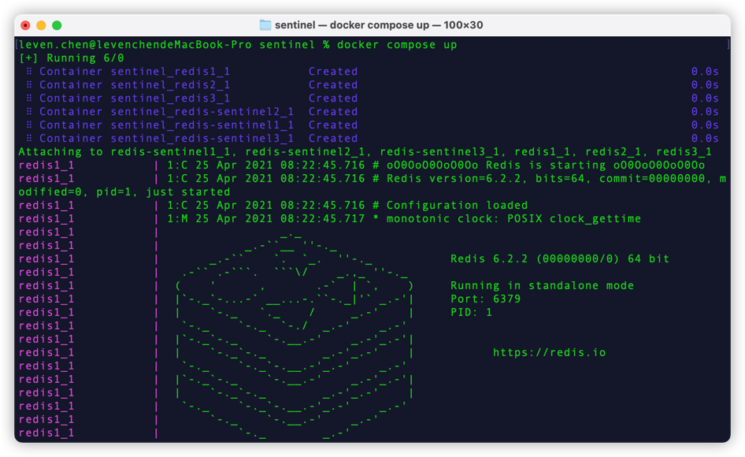
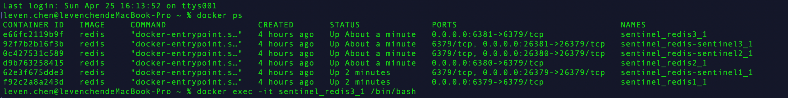
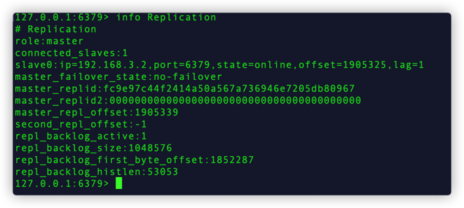
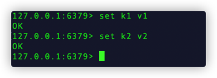
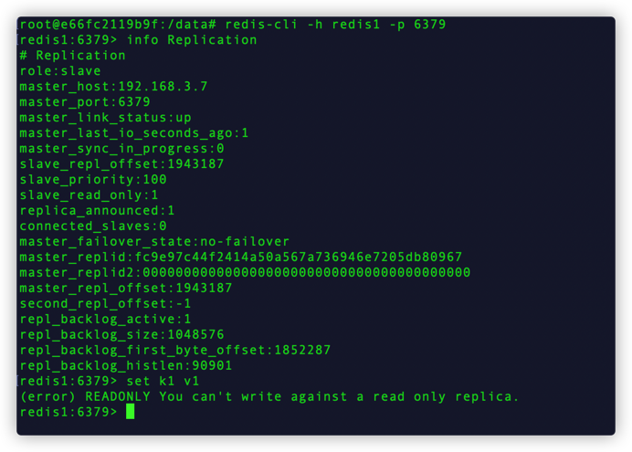
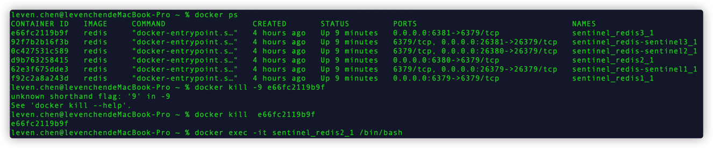
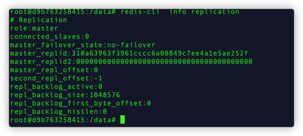

## 架构
### 模式

主192.168.3.1  -> 从192.168.3.2  -> 从192.168.3.2

### sentinel 
- redis-sentinel1 192.168.3.4
- redis-sentinel2 192.168.3.5
- redis-sentinel3 192.168.3.6

## 测试

###启动
```shell
docker compose up
```


### redis cli 

- 选择某一个docker进入容器内


- 使用redis cli连接并查看info

  
- 在master节点测试设置值

  
- 切换至slave进行测试set值

  
- 将master下线，测试主从切换

  


可见已成功重新选举

### 问题&思考
1. 配置哨兵时```sentinel monitor mymaster 192.168.3.5 6379 2`` 必须使用ip，无法使用hostname？

2. Master is currently unable to PSYNC but should be in the future: -NOMASTERLINK Can't SYNC while not connected with my master?

3. 出现双主?
```log
root@d9b763258415:/data# redis-cli -h redis1 -p 6379
redis1:6379> info replication
# Replication
role:slave
master_host:192.168.3.7
master_port:6379
master_link_status:up
master_last_io_seconds_ago:0
master_sync_in_progress:0
slave_repl_offset:2059994
slave_priority:100
slave_read_only:1
replica_announced:1
connected_slaves:0
master_failover_state:no-failover
master_replid:e6b791ea2f6b854a444e7e3c57567515e4e7d8b0
master_replid2:a87fae20c6b8c525e1f59684ad0890f62b8d4300
master_repl_offset:2059994
second_repl_offset:1983224
repl_backlog_active:1
repl_backlog_size:1048576
repl_backlog_first_byte_offset:1852287
repl_backlog_histlen:207708
redis1:6379> exit
root@d9b763258415:/data# redis-cli -h redis2 -p 6379
redis2:6379> info replication
# Replication
role:master
connected_slaves:0
master_failover_state:no-failover
master_replid:310a63963f3961cccc6a08849c7ee4a1e5ae252f
master_replid2:0000000000000000000000000000000000000000
master_repl_offset:0
second_repl_offset:-1
repl_backlog_active:0
repl_backlog_size:1048576
repl_backlog_first_byte_offset:0
repl_backlog_histlen:0
redis2:6379> exit
root@d9b763258415:/data# redis-cli -h redis3 -p 6379
redis3:6379> info replication
# Replication
role:master
connected_slaves:1
slave0:ip=192.168.3.2,port=6379,state=online,offset=2067037,lag=1
master_failover_state:no-failover
master_replid:e6b791ea2f6b854a444e7e3c57567515e4e7d8b0
master_replid2:a87fae20c6b8c525e1f59684ad0890f62b8d4300
master_repl_offset:2067037
second_repl_offset:1983224
repl_backlog_active:1
repl_backlog_size:1048576
repl_backlog_first_byte_offset:1979625
repl_backlog_histlen:87413
redis3:6379> 

```
